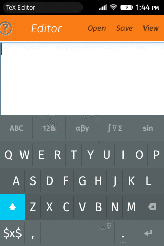
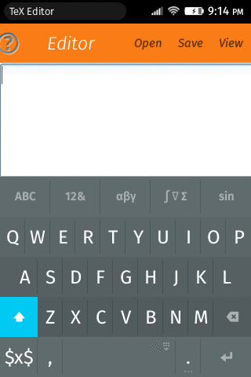
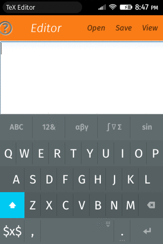
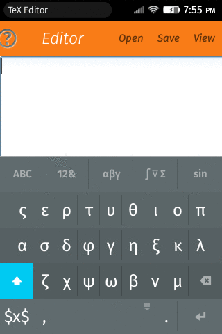

One of many ways to write mathematics is using (La)TeX. Unfortunately it
requires the frequent use of some special characters, such as `\`, `{`, `}`, `_`,
and `^`, that aren't easily accessible at virtual keyboards. To try to improve
your typing speed you can use a virtual keyboard specially designed for (La)TeX.

This virtual keyboard is an
[open source project](https://github.com/r-gaia-cs/gsoc2014)
that started as a
[Google Summer of Code 2014's project](https://www.google-melange.com/gsoc/proposal/public/google/gsoc2014/r_gaia_cs/5629499534213120).
Right now it is **only** available for
[Firefox OS](https://www.mozilla.org/firefox/os/),
and you can install it from the
[Marketplace](https://marketplace.firefox.com/app/latex-keyboard).

## Features

- Styled letters are available as alternate keys.

- Many symbols are available as alternate keys, e.g. the n-ary product (∏) can be
  obtained with a long pressing at the n-ary summation (∑).

- Smart dots, i.e., pressing three dots results in `\dots`.

- Auto capitalization, i.e., if the text before the cursor is `. ` the
  capitalization is automatically enabled.

- Pressing the return key will trigger a heuristics that changes the cursor position
  inside or outside the command/environment option/argument, and if there isn't
  a position to jump into, it inserts a new line.

- Subscript and superscript behave differently if the character behind the cursor
  is a empty space or not. If the character behind the cursor is a empty space
  the keyboard will insert ``{}``, otherwise it won't.

- If the cursor is immediately after a (La)TeX command, the backspace key will
  remove this (La)TeX command.

