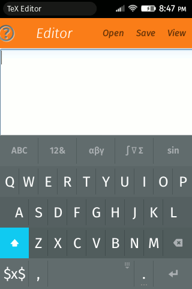
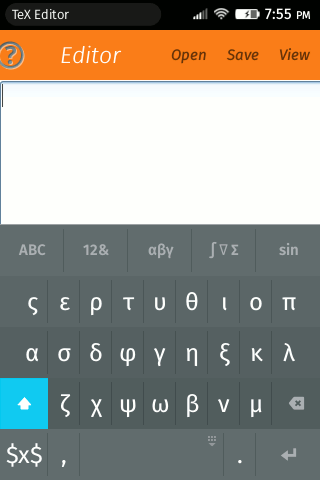

One of the widely ways to write mathematics is using (La)TeX. Unfortunately it
require the frequently use of some special characters like `\`, `{`, `}`, `_`,
`^` that aren't easy accessible at virtual keyboards. To try solving this
problem there is a [special virtual
keyboard](https://marketplace.firefox.com/app/latex-keyboard) for Firefox OS
devices.

## Features

- Styled letters are available as alternate keys.

- Many symbols are available as alternate keys, e.g. the ∏ is available as the
  alternate of ∑.
- Press the return key will trigger a heuristic that change the cursor position
  inside or outside command/environment option/argument and if there isn't
  position to jump insert a new line.

- Subscript and superscript behave different if the character behind the cursor
  is a empty space or not. If the character behind the cursor is a empty space
  the keyboard will insert ``{}`` otherwise not.

- If the cursor is immediately after a (La)TeX commands the backspace key will
  remove this (La)TeX commands.

